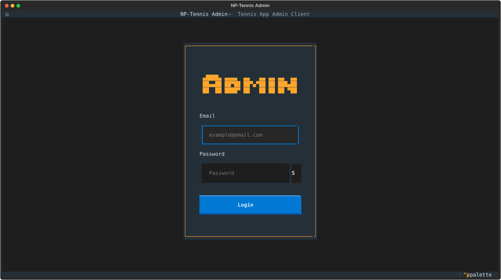
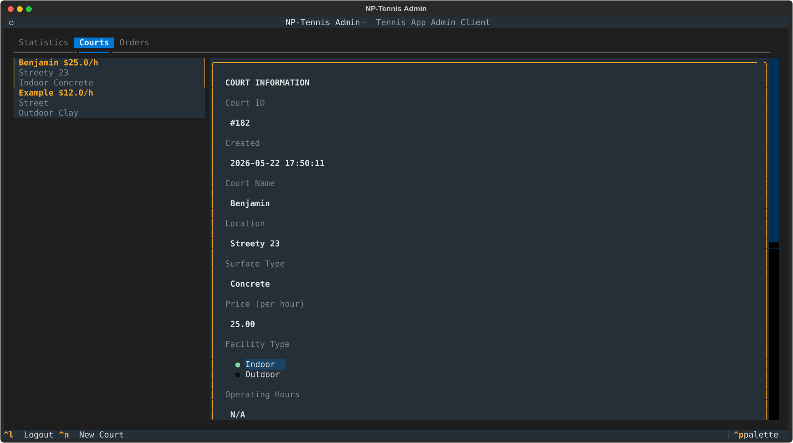
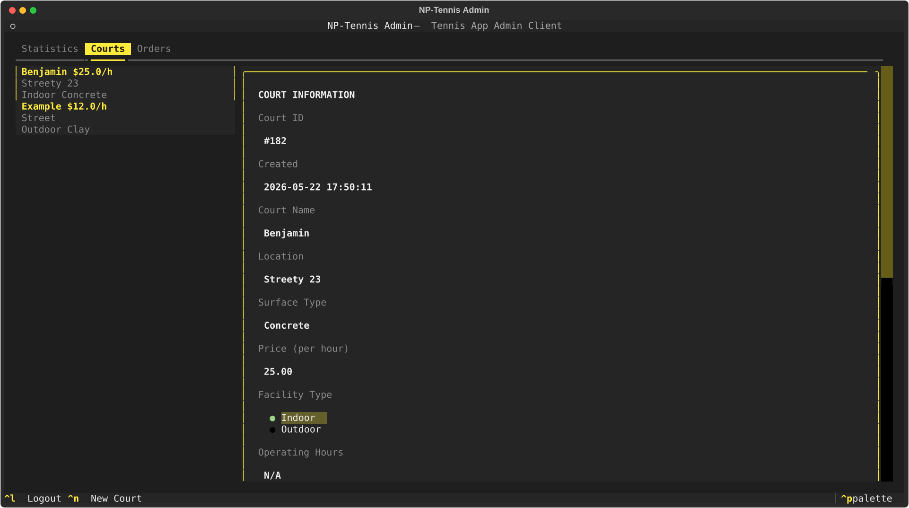
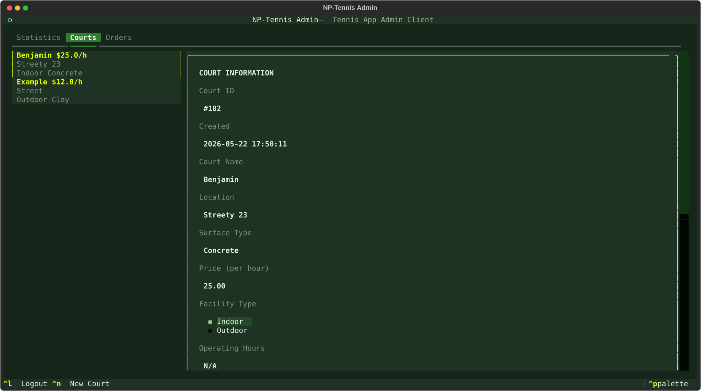
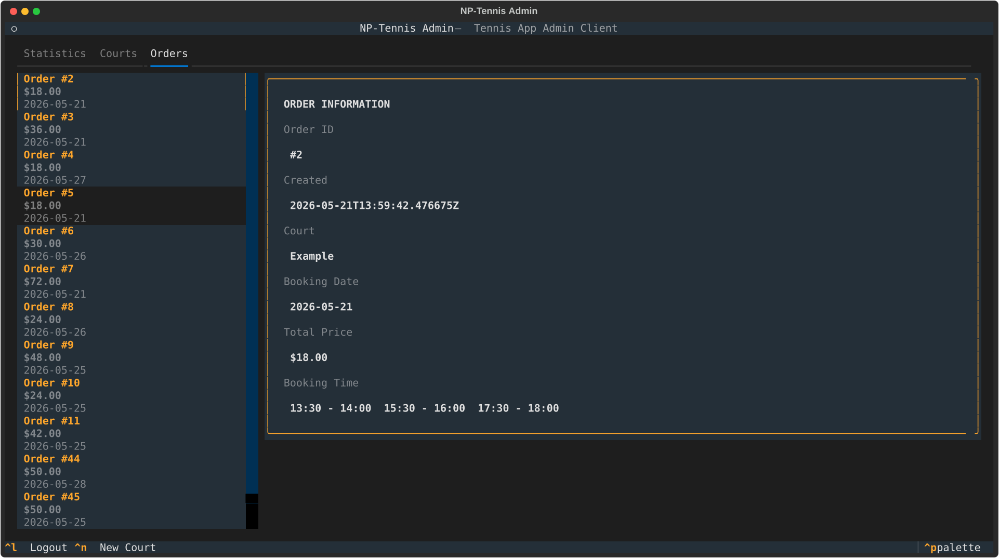

# NP-Tennis Admin

A terminal-based (TUI) admin client for the NP-Tennis court booking system, built with [Textual](https://github.com/Textualize/textual).

Manage courts, orders, and users -- all from the terminal.

## Features

- **Authentication** -- Login with email/password, token persistence via system keyring, auto-refresh on expiry
- **Court Management** -- Create, edit, delete tennis courts; view and modify weekly schedules; configure surface type, location, price, and facility (indoor/outdoor)
- **Order Management** -- Browse all orders with booking time ranges; view order details (ID, date, total, court)
- **Dashboard Hub** -- Tabbed interface with Statistics, Courts, and Orders panes; keyboard-driven navigation
- **Theme Support** -- Built-in dark themes (default tennis, minimal, alpha), switchable at runtime
- **Secure Token Storage** -- Refresh tokens stored in the OS keyring via `keyring`
- **Offline/Error Resilience** -- Graceful handling of network errors, 401 auto-refresh, 403 forbidden checks for non-admin users
- **Responsive Layout** -- Widgets adapt to terminal size (e.g., court cards collapse to compact mode on narrow terminals)

## Prerequisites

- Python **3.11+**
- A running NP-Tennis backend API (FastAPI)

## Installation

### 1. Create a virtual environment

**Windows:**

```bash
py -m venv .venv
```

**Linux/macOS:**

```bash
python3 -m venv .venv
```

### 2. Activate the virtual environment

**Windows:**

```bash
.venv\Scripts\activate
```

**Linux/macOS:**

```bash
source .venv/bin/activate
```

### 3. Install the package and dependencies

**Windows:**

```bash
py -m pip install -e ".[dev]"
```

**Linux/macOS:**

```bash
pip3 install -e ".[dev]"
```

### 4. Configure environment variables

Copy `.env.example` to `.env` and adjust the values:

```env
SERVICE_NAME="NP-TENNIS-ADMIN"
KEY_NAME="refresh_token"
API_URL=http://localhost:8000
```

| Variable       | Description                            |
|----------------|----------------------------------------|
| `SERVICE_NAME` | Keyring service name for token storage |
| `KEY_NAME`     | Keyring key name for the refresh token |
| `API_URL`      | Base URL of the NP-Tennis backend API  |

### 5. Run the application

**Windows:**

```powershell
./tasks.ps1 run
```

**Linux/macOS:**

```bash
make run
```

### Build a standalone executable (optional)

**Windows:**

```powershell
./tasks.ps1 build
```

**Linux/macOS:**

```bash
make build
```

## Screenshots


<p align="center"><em>Login screen</em></p>


<p align="center"><em>Courts tab — default theme</em></p>


<p align="center"><em>Courts tab — minimal theme</em></p>


<p align="center"><em>Courts tab — np-tennis theme</em></p>


<p align="center"><em>Orders tab</em></p>

## Project Structure

```
admin-frontend/
├── .env.example              # Environment variable template
├── build.py                  # PyInstaller build script
├── Makefile                  # Linux/macOS task runner
├── tasks.ps1                 # Windows PowerShell task runner
├── NP-Tennis-Admin.spec      # PyInstaller spec
├── pyproject.toml            # Project metadata, dependencies, tooling config
├── styles/                   # Textual CSS stylesheets (*.tcss)
│   ├── styles.tcss
│   ├── buttons.tcss
│   ├── login_screen.tcss
│   ├── modals.tcss
│   ├── courts.tcss
│   ├── stats.tcss
│   └── dashboard_screen.tcss
└── src/tuiapp/               # Application package
    ├── __init__.py
    ├── main.py               # Entry point
    ├── app.py                # TUIApplication (root App class)
    ├── settings.py           # Pydantic-settings configuration
    ├── themes.py             # Theme definitions
    ├── time_utils.py         # Timezone conversion helpers
    ├── api/                  # Backend API layer
    │   ├── client.py         # Async HTTP client (httpx)
    │   ├── errors.py         # APIError exception
    │   ├── schema.py         # Common schemas (Result, Message)
    │   ├── auth/
    │   │   ├── auth.py         # AuthService (login, me)
    │   │   ├── auth_guard.py   # AuthGuard mixin
    │   │   ├── schema.py       # Auth Pydantic models
    │   │   └── token_manager.py # Token persistence & refresh
    │   ├── court/
    │   │   ├── court.py        # CourtService (CRUD + schedule)
    │   │   └── schema.py       # Court Pydantic models
    │   └── order/
    │       ├── order.py        # OrderService (CRUD)
    │       └── schema.py       # Order Pydantic models
    ├── screens/              # Top-level screens
    │   ├── base_screen.py    # BaseScreen, AuthScreen
    │   ├── dashboard_screen.py # Main hub after login
    │   └── login_screen.py   # Login form screen
    └── widgets/              # Reusable UI components
        ├── buttons.py        # Primary, Secondary, Danger buttons
        ├── inputs.py         # TextInput, PasswordInput, CodeInput, etc.
        ├── stat_card.py      # Statistics card
        ├── stats_container.py # Horizontal stats container
        ├── courts/
        │   ├── card_container.py # Scrollable vertical card list
        │   └── court_card.py   # Court summary card
        ├── forms/
        │   └── login_form.py   # Login form (email + password fields)
        ├── modals/
        │   ├── base_modal.py          # BaseModal with overlay
        │   ├── confirmation_modal.py  # Yes/No confirmation dialog
        │   └── create_court_modal.py  # Court creation form
        ├── order/
        │   └── order_card.py  # Order summary card
        └── views/
            ├── base_view.py    # Abstract view base class
            ├── court_view.py   # Court detail/edit/schedule view
            └── order_view.py   # Order detail view
```

## Tech Stack

| Layer         | Technology                                                                        |
|---------------|-----------------------------------------------------------------------------------|
| Framework     | [Textual](https://github.com/Textualize/textual) >= 0.50                          |
| HTTP Client   | [httpx](https://www.python-httpx.org/) >= 0.27                                    |
| Validation    | [Pydantic](https://docs.pydantic.dev/) >= 2.0                                     |
| Settings      | [pydantic-settings](https://docs.pydantic.dev/latest/concepts/pydantic_settings/) |
| Keyring       | [keyring](https://github.com/jaraco/keyring) >= 25.7                              |
| Linting       | Ruff, mypy                                                                        |
| Testing       | pytest, pytest-asyncio                                                            |
| Packaging     | setuptools, PyInstaller (optional)                                                |

## License

[MIT](LICENSE)
